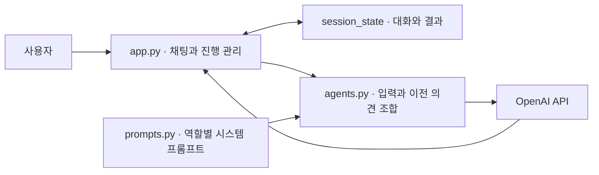

# 🍽️ 오늘 뭐 먹지 AI 위원회

먹고 싶은 음식, 어제 먹은 음식, 예산, 현재 기분을 바탕으로 오늘의 메뉴를 추천하는 Streamlit 앱입니다. 경제성·영양·미식 전문가가 차례로 의견을 내고, 중재자가 이를 종합해 메뉴 하나를 선택합니다.

**역할별 LLM 호출로 멀티 에이전트 시스템의 협업 흐름을 데모하는 프로그램입니다.** 독립적으로 계획하고 도구를 실행하는 실제 자율 에이전트를 구현한 것은 아닙니다. 동일한 모델에 서로 다른 시스템 프롬프트를 전달하고, 앞선 응답을 다음 요청에 포함해 전문가들이 의견을 주고받는 모습을 구현합니다.

## 설치 및 실행

Python 3.11 이상과 OpenAI API 키가 필요합니다.

```bash
git clone https://github.com/seewhyDev/meal-council-demo.git
cd meal-council-demo
python3 -m venv .venv
source .venv/bin/activate
python -m pip install -r requirements.txt
cp .env.example .env
```

Windows PowerShell에서는 `python3` 대신 `python`, 가상환경 활성화는 `.venv\Scripts\Activate.ps1`, 파일 복사는 `Copy-Item .env.example .env`를 사용합니다.

`.env`에 API 키를 입력합니다. 기본 모델은 `gpt-5-mini`이며, `OPENAI_MODEL`로 변경할 수 있습니다.

```env
OPENAI_API_KEY=your_api_key
OPENAI_MODEL=gpt-5-mini
```

운영체제에 같은 이름의 환경변수가 설정되어 있으면 `.env`보다 우선합니다. `.env`는 Git에서 제외되므로 API 키를 저장소에 올리지 마세요. 추천을 실행하면 OpenAI API 이용 요금이 발생합니다.

```bash
python -m streamlit run app.py
```

브라우저에서 [localhost:8501](http://localhost:8501)을 엽니다.

## 사용 방법

1. 채팅창에서 **먹고 싶은 음식 → 어제 먹은 음식 → 한 끼 예산 → 현재 기분**에 차례로 답합니다. `매콤한 국물`, `점심 돈까스, 저녁 라면`, `15,000원 정도`, `피곤함`처럼 자유롭게 입력하면 됩니다.
2. 마지막 답변을 입력하면 위원회가 자동으로 시작됩니다. 전문가별 의견이 순서대로 나타나고, 중재자의 최종 추천은 초록색 상자로 표시됩니다.
3. **🔄 다시 추천받기**를 누르면 새 대화를 시작합니다.

호출이 실패하면 화면의 안내에 따라 키·모델·네트워크 설정을 확인한 뒤 **🔁 실패한 전문가 다시 시도**를 누릅니다. 완료된 의견은 유지하고 실패한 단계부터 이어서 진행합니다.

## 아키텍처

Streamlit이 화면과 진행 상태를 관리하고, Python 함수가 전문가별 프롬프트를 구성해 OpenAI API를 순차 호출합니다. 별도 에이전트 프레임워크나 데이터베이스는 사용하지 않습니다.



### 전문가 간 정보 전달

모든 전문가는 네 가지 사용자 정보를 공통으로 받습니다. 뒤의 전문가는 앞선 전문가들의 응답도 함께 읽습니다.

| 호출 순서 | 역할 | 추가로 받는 의견 | 판단 기준 |
| --- | --- | --- | --- |
| 1 | 💰 경제성 | 없음 | 예산, 가격 대비 만족도와 포만감 |
| 2 | 🥗 영양 | 경제성 | 전날 식사, 영양 균형, 컨디션 |
| 3 | 😋 미식 | 경제성·영양 | 음식 취향, 맛, 현재 기분과 만족도 |
| 4 | ⚖️ 중재자 | 경제성·영양·미식 | 세 관점을 종합해 구체적인 메뉴 하나 선택 |

예를 들어 경제성 전문가가 순두부찌개를 추천하면, 영양 전문가는 그 의견을 읽고 전날 식단을 고려한 보완 의견을 낼 수 있습니다. 미식 전문가는 두 의견을 검토하고, 중재자는 모든 의견을 종합합니다. 실제 발언과 메뉴는 모델이 생성하므로 실행마다 달라질 수 있습니다.

각 요청은 **역할별 시스템 프롬프트 + 사용자 정보 + 필요한 이전 의견**으로 구성됩니다. 호출 사이에 기억이 자동으로 공유되는 것이 아니라 코드가 응답 문자열을 다음 요청에 직접 넣습니다. 호출 순서와 종료 시점도 코드가 정하며, 각 역할은 한 번씩 발언합니다. 정상 완료되는 추천 한 번에는 총 네 번의 LLM 호출이 발생합니다.

### 상태와 구현 범위

- 대화와 완료된 결과를 `st.session_state`에 저장해 같은 세션의 화면 재실행에서 중복 호출을 방지합니다. 실패하거나 중단된 요청은 사용자가 버튼을 눌러야 재시도하며, 재시도 시 새 API 요청이 발생합니다.
- 대화는 현재 세션에만 보관합니다. 브라우저 새로고침으로 연결이 초기화되거나 서버가 재시작되면 사라질 수 있습니다.
- 음식점 검색, 실시간 가격 조회, 장기 기억, 반복 토론은 포함하지 않습니다. 가격은 모델의 추정이며, 최종 메뉴와 답변 형식은 프롬프트 지시에 따라 생성됩니다.

## 파일 구성

| 파일 | 역할 |
| --- | --- |
| `app.py` | 채팅 UI, 입력 단계, 순차 호출, 재시도와 초기화 |
| `agents.py` | 요청 구성, 이전 의견 전달, OpenAI API 호출과 오류 처리 |
| `prompts.py` | 전문가별 역할과 답변 형식 |
| `.env.example` | API 키와 모델 설정 예시 |
| `requirements.txt` | Python 의존성 |
| `tests/` | 정보 전달, 채팅 흐름, 중복 호출 방지와 오류 복구 테스트 |

역할과 판단 기준은 `prompts.py`, 질문과 호출 순서는 `app.py`, API 요청 방식은 `agents.py`에서 수정할 수 있습니다.

## 테스트

```bash
python -m unittest discover -s tests -v
```

모의 API 응답과 Streamlit `AppTest`를 사용하므로 실제 API 키나 호출 비용 없이 실행됩니다. 실제 모델의 추천 품질과 API 접근 여부는 앱에서 별도로 확인해야 합니다.
